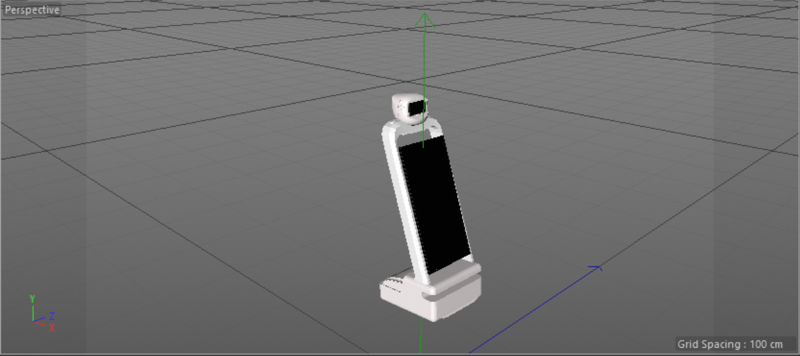

# Ads robot
Ads Robot It facilitates the entertaining, quick, and useful transmission of advertisements.

# Project
In this repository, we'll take a look at the following ideas:
 1. Main Idea:
    
    The robot will interact with its environment through its eye screen and is dedicated to delivering adverts on its front screen.
    He is able to move, sense, turn his head, and track the advertisement's view.
    
 2. Additional Idea (Personal Engagement):
    
    This robot has numerous more points in addition to everything included in the basic robot.
    The robot will be able to use the escalator, and it will have a loudspeaker to preserve and emphasize the sound of the advertisement.
    It will also have a storage room in the back that has temperature control and movable shelves to display any advertisement samples that may be present.

# Robot Pieces 
 include two parts:
 1. body
 2. head
    
# Project 1 ( Main Idea )

  ## Robot Design

  

# Project 2 ( Additional Idea )

  ## Robot Design
   The project will only have a sketch, leaving me hopeful that it indicates a thorough comprehension of it.

  

